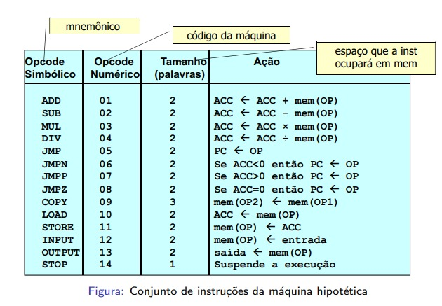

# Montador assembly

Esse trabalho é um montador e um simulador de código assembly inventado realizado para a disciplina de Software Básico-UnB no segundo semestre de 2020.

## Ambiente de Desenvolvimento
O código foi desenvolvido em c++ e compilado com g++ versão 9.3.0 em um Ubuntu 20.04, mas deve ser possível utilizá-lo com qualquer compilador quer suporte o padrão c++11.


## Compilação

O código pode ser compilado utilizando o makefile disponível no diretório principal da aplicação. Assim basta digitar make que o simulador e o montador serão compilados. 
```
make
```

Caso o usuário não tenha suporte a make o **montador** pode ser compilado com o comando:

```
g++ -std=c++11 -c ./sources/pre_processamento.cpp ./sources/primeira_passagem.cpp ./sources/segunda_passagem.cpp ./sources/util.cpp
```

Em seguida a compilação e ligação é feita com:

```
g++ -std=c++11 montador.cpp  pre_processamento.o primeira_passagem.o segunda_passagem.o util.o -o montador
```

E o **simulador** com os comandos:
```
g++ -std=c++11 -c ./sources/fonte_simulador.cpp ./sources/util.cpp
```
Em seguida a compilação e ligação é feita com:
```
g++ -std=c++11 simulador.cpp  fonte_simulador.o util.o -o simulador
```

## Execução
Para executar o montador é necessário passar um programa de texto com a linguagem de assembly inventada. Exemplo:
```
./montador exemplo.asm
```

Para executar o simulador é necessário passar um programa texto com um código objeto gerado pelo montador. Exemplo:
```
./simulador exemplo.obj
```

## Linguagem assembly inventada

O montador suporta o seguinte conjunto de instruções que é utilizado na disciplina.


